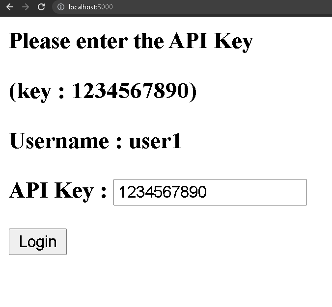
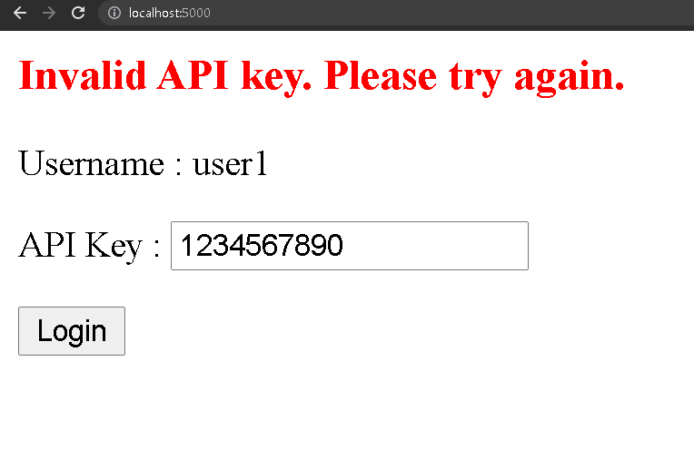
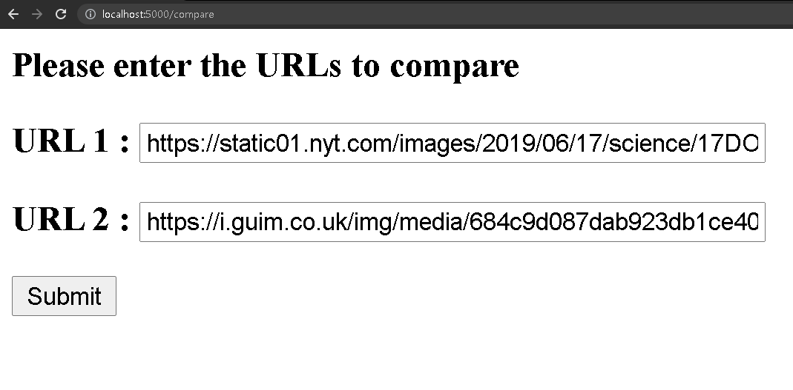
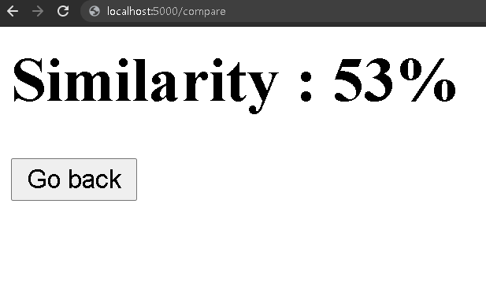

## Image Similarity

### This API compares two images, and returns the simailarity as percentage

#### ▶ Usage

#### 1. API key authorization



#### 2. Warning for invalid API key



#### 3. Image URL inputs 



#### 4. Result




#### ▶  Packages to install

```bash
pip install flask
```
```bash
pip install Pillow
```
```bash
pip install ImageHash
```


#### ▶ Run commands

1. ```export FLASK_APP=main```
2. ```flask run```

#### ▶  Environment

- OS : Windows
- Language : Python 3.9.0
- Libraries :
  - Flask
  - Pillow
  - ImageHash
