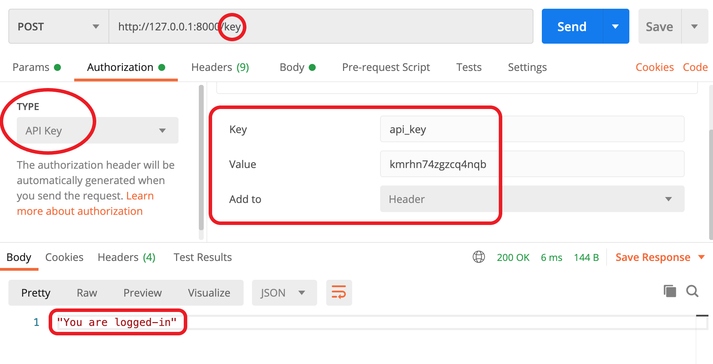
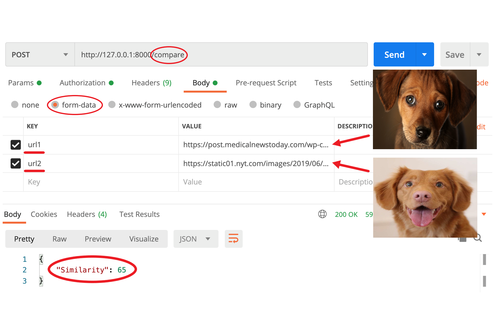

## Image Similarity

### This API compares two images, and returns simailarity figure as JSON response.

#### ▶ How to test out with Postman

#### < API key input >



#### < Image inputs >



#### ▶  Please install before you test out

```bash
pip install fastapi
pip install python-multipart     (to receive 'form-data')
pip install Pillow               (instead of PIL)
pip install 'uvicorn[standard]'  (For Mac)
pip install uvicorn[standard]    (For Windows)
```


#### ▶ Please run the command to run the server

```bash
uvicorn main:app --reload
```


#### ▶  Three routes :

  - http://127.0.0.1:8000/         -> landing page
  - http://127.0.0.1:8000/key      -> API Key validation
  - http://127.0.0.1:8000/compare  -> Image comparison
  
  
#### ▶  Environment

- macOS Big Sur 11.0.1
- Python 3.7.0
- FastAPI 0.63.0
- Pillow 8.1.0
- ImageHash 4.2.0
